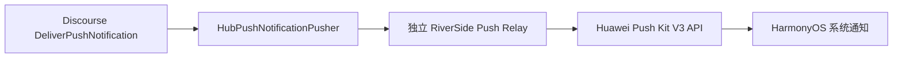

# RiverSide HarmonyOS 与 Discourse 推送通知研究

研究日期：2026-07-25

研究范围：

- HarmonyOS 客户端：`/Users/jackzhang/Code/RiversideApp-HarmonyOS`
- 客户端基线提交：`8af9e725feca886edfadc76ee7fda113c2bc27d7`
- Discourse 源码：`/Users/jackzhang/Code/discourse`（用户所说的 `~/discourse` 在本机的实际位置）
- Discourse 基线提交：`545168826bcc89dc631b5f3a641ad0a03970eb41`

本记录只做设计研究，没有修改 APP 或 Discourse 业务源码。

## 第一版范围裁决

第一版只支持两种通知：

| 用户场景 | Discourse `Notification.types` | Huawei category |
| --- | --- | --- |
| 有人直接 Reply 了我的 Post | `replied`（2） | `SUBSCRIPTION` |
| 有人给我发送或回复了 Private Message | `private_message`（6） | `IM` |

明确不包含：

- watched Topic/Category/Tag 的普通新 Post（`posted`）
- `mentioned`、`group_mentioned`、`quoted`
- `liked`、Reaction
- `invited_to_private_message`
- Discourse Chat

插件仍监听单一的 `:push_notification` 事件，但进入 Job 前只接受上表两个精确类型。为避免类型与内容错配，还应在 Job 中复核：

- `replied` 的 Topic 不是 Private Message；
- `private_message` 的 Topic 必须是 Private Message；
- Post、Topic 和 User API Key 仍存在，并且 `Guardian.new(user).can_see?(post)`。

不要同时监听 `:notification_created`，也不要监听 `:post_created` 后自行推导接收者。

## 结论

这个需求应使用 HarmonyOS Push Kit 的**通知消息**，而不是让 APP 常驻后台，也不是使用 Push Kit 的“后台消息”。

Push Kit 使用系统级长连接；即使 APP 进程不存在，通知消息仍可由系统接收并展示。相反，Push Kit 的“后台消息”在 APP 不位于前台时只会缓存，等 APP 下次启动后才交给应用，不适合 Reply 和 Private Message 的即时提醒。[Push Kit 简介](https://developer.huawei.com/consumer/cn/doc/harmonyos-guides/push-kit-introduction)

HarmonyOS 的代理提醒由系统在应用退出后代理倒计时、日历和闹钟类定时通知。它有场景和权益限制，不适合由 Discourse 服务端动态产生的论坛通知。[代理提醒（ArkTS）](https://developer.huawei.com/consumer/cn/doc/harmonyos-guides/agent-powered-reminder)

Discourse 已经有完整的推送上游链路：

1. 根据用户关注、静音、忽略、权限和通知偏好决定是否产生提醒。
2. 构造含 Topic、Post、通知类型、标题和摘要的推送 payload。
3. 通过后台 Job 发送 Web Push 或移动端 Push Hub。

因此插件不应监听 `post_created` 后重新计算收件人。若采用 Discourse 内直连华为 Push Kit 的插件，首选监听 `:push_notification`，再由插件自己的 Sidekiq Job 调用华为 V3 API。

不过，Discourse 核心已经支持 User API Key 的 `push_url`/Push Hub。如果可以部署一个独立推送中继服务，严格来说可能不需要 Discourse 插件；APP 授权时增加 `push` scope 与 `push_url`，由核心把通知交给中继，再由中继调用华为 Push Kit。

## 推荐架构

如果目标是“所有服务端逻辑都留在现有 Discourse 部署中”，推荐插件直连方案：


如果可以接受独立推送中继，优先做一个小型技术验证，因为这条路最大限度复用 Discourse 核心：



两条路线的比较：

| 方案 | 优点 | 代价 |
| --- | --- | --- |
| 独立 Push Relay | 直接复用 Discourse 核心 `push` scope、在线时间窗、本地化与 Hub payload；对 Discourse 改动最小 | 需要部署、鉴权和监控一个独立服务；还要安全维护 `client_id` 到 Push Token 的映射 |
| Discourse 插件直连 Push Kit | 部署单一；设备订阅与用户天然在同一数据库；符合当前“写插件”的计划 | 插件必须显式复用 push filters、在线时间窗、权限复核、重试和失效 Token 清理 |

## HarmonyOS 侧

### 1. 无后台提醒的正确能力

Push Kit 官方说明系统级通道可以在应用进程不存在时实时推送消息。通知消息由 Push Kit 直接下发，可展示在通知中心、锁屏和横幅，用户点击后拉起 APP。[Push Kit 简介](https://developer.huawei.com/consumer/cn/doc/harmonyos-guides/push-kit-introduction)；[发送通知消息](https://developer.huawei.com/consumer/cn/doc/harmonyos-guides/push-send-alert)

这意味着：

- 不需要申请长时后台任务。
- 不需要 APP 自己维持 WebSocket 或轮询。
- 不需要 `PushExtensionAbility` 来展示普通通知消息。
- APP 被系统回收或进程未启动时仍能展示通知，但仍受网络、通知开关、设备策略、用户睡眠管控和 Push Kit 频控影响，不能承诺绝对实时。

不要使用 Push Kit “后台消息”做论坛提醒。官方定义是：APP 在前台时把消息交给 APP；不在前台时缓存，等待 APP 启动后再交付。[Push Kit 简介](https://developer.huawei.com/consumer/cn/doc/harmonyos-guides/push-kit-introduction)

### 2. 开通与签名

需要在 AppGallery Connect 为当前项目开通 Push Kit。开通后必须重新生成包含推送开放能力的调试 Profile；发布时也必须在开通推送后重新申请发布 Profile。[开通推送服务](https://developer.huawei.com/consumer/cn/doc/harmonyos-guides/push-config-setting)

当前 APP 的 bundle name 是 `cc.river_side_hm.app`，目标和兼容 SDK 都是 `6.1.0(23)`：

- `app/AppScope/app.json5:3`
- `app/build-profile.json5:22-23`

API 23 对本项目有一个直接好处：Phone 从 `6.1.0(23)` 起支持 `pushService.on('tokenUpdate')`，可在 Token 自动更新时及时上报。[获取 Push Token](https://developer.huawei.com/consumer/cn/doc/harmonyos-guides/push-get-token)

### 3. 通知授权

APP 通知开关默认关闭。客户端需要：

1. 先调用 `notificationManager.isNotificationEnabled()`。
2. 在用户明确开启“系统通知”时调用 `requestEnableNotification(context)`。
3. 用户拒绝后，不能再次用同一接口弹系统授权窗；需要用 `openNotificationSettingsWithResult(context)` 打开通知设置。[请求通知授权](https://developer.huawei.com/consumer/cn/doc/harmonyos-guides/notification-enable)

建议不要首次启动就弹授权。先在 APP 内解释 Reply 和 Private Message 分别会触发什么提醒，再由用户主动开启。这个设置页也有助于申请华为 `SUBSCRIPTION` 与 `IM` 自分类权益。

### 4. Push Token 生命周期

官方建议每次 APP 启动时调用 `pushService.getToken()`，Token 变化后及时上报服务端。Token 在重装 APP、恢复出厂、显式删除 Token/AAID 等场景会变化；不要依赖固定 Token 长度，也不要用它追踪用户。[获取 Push Token](https://developer.huawei.com/consumer/cn/doc/harmonyos-guides/push-get-token)

推荐生命周期：

- APP 启动：获取 Token；若存在 Authenticated Session 且用户已开启系统通知，则幂等上报。
- Token 更新：使用 API 23 的 `tokenUpdate` 回调重新上报。
- 登录新账号：同一 Token 应原子地改绑到当前用户，避免旧账号通知继续送到设备。
- 退出登录或切换账号：先在 Authenticated Session 仍有效时尽力注销服务端设备记录和撤销 User API Key，再调用 `pushService.deleteToken()`，最后才清除本地 Authenticated Session。下一次登录重新 `getToken()` 并注册。Push Token 与 APP 账号无关，不做这一步会产生同设备账号切换后的串号风险。
- 服务端：只向仍有有效 User API Key/Authenticated Session 关联的设备记录发送；即使客户端离线注销失败，也不继续给已撤销会话推送。

Push Token 是敏感凭据：日志中不得打印完整值；数据库至少保存单独的 Token 指纹用于查重，明文或可解密值只能用于实际发送。

### 5. 点击通知与 APP 导航

Push Kit 的 `clickAction.data` 会在冷启动时进入 `UIAbility.onCreate(want, ...)`，热启动时进入单例 Ability 的 `onNewWant(want, ...)`。[发送通知消息：数据传递](https://developer.huawei.com/consumer/cn/doc/harmonyos-guides/push-send-alert#section108252081117)

当前 APP：

- `EntryAbility` 已是入口 Ability，但 `onCreate` 没有处理推送参数，也没有 `onNewWant`：`app/entry/src/main/ets/entryability/EntryAbility.ets:29-37`。
- `module.json5` 的首页 skill 已正确使用 `entity.system.home` 与 `ohos.want.action.home`，且没有 `uris`：`app/entry/src/main/module.json5:27-39`。这符合 `actionType: 0` 的官方要求。
- 站内通知已经能按 `topicId` 和 `postNumber` 打开对应 Topic/Post：`app/entry/src/main/ets/pages/Index.ets:935-949`。
- `AppShellModel.openTopic` 已支持指定初始 Post：`app/entry/src/main/ets/app/AppShellModel.ets:214-276`。

因此以后不应在 `EntryAbility` 里直接操作 ArkUI 页面，而应增加一个严格类型化、可排队的一次性导航目标：

```text
Push click data
  -> EntryAbility 校验 kind/topicId/postNumber
  -> 冷/热启动统一写入 PendingNavigationStore
  -> Index 完成 Authenticated Session 与 AppShellModel 初始化
  -> 消费目标
  -> 复用现有 openTopic(topic, postNumber)
```

建议的第一版点击数据只包含不可伪造权限、也不会泄漏正文的标量：

```json
{
  "kind": "topic_post",
  "topicId": 123,
  "postNumber": 7
}
```

客户端必须把这些值当作不可信输入：显式检查字符串枚举、正安全整数和上限。点击后仍由 Discourse API 和 Guardian 权限决定是否能读取目标内容。

### 6. 华为通知分类

没有申请“通知消息自分类权益”时，所有通知默认是 `MARKETING`，通常每天每设备只有 2 条或 5 条，而且在 Phone 上属于静默、仅通知中心展示，不满足论坛提醒预期。[申请推送场景化消息权益](https://developer.huawei.com/consumer/cn/doc/harmonyos-guides/push-apply-right)

论坛场景建议申请：

| Discourse 场景 | 建议 category | 依据 |
| --- | --- | --- |
| 直接 Reply | `SUBSCRIPTION` | 华为将评论、回复等用户社交互动列入订阅类服务提醒 |
| Discourse Private Message | `IM` | 华为将点对点私信列为即时聊天 |
| 未订阅的 Topic 推荐、运营公告 | `MARKETING` | 非用户主动订阅的内容推荐属于资讯营销 |

APP 设置中只需提供 Reply 和 Private Message 两个独立开关。申请 `SUBSCRIPTION` 时，推送标题或正文需要明确体现回复关系。[申请推送场景化消息权益](https://developer.huawei.com/consumer/cn/doc/harmonyos-guides/push-apply-right)

### 7. 云端 Push API

HarmonyOS NEXT/5.x 及之后使用：

```text
POST https://push-api.cloud.huawei.com/v3/[projectId]/messages:send
Content-Type: application/json
Authorization: Bearer <JWT>
push-type: 0
```

服务账号 JWT 使用 `PS256`：

- Header：`kid`、`typ=JWT`、`alg=PS256`
- Payload：`iss=sub_account`、固定 `aud`、`iat`、`exp`
- 官方示例令 `exp = iat + 3600` 秒；服务端应缓存并复用未到期 JWT，而不是每条通知重新生成。[基于服务账号生成鉴权令牌](https://developer.huawei.com/consumer/cn/doc/harmonyos-guides/push-jwt-token)

通知请求建议：

- `push-type: 0`
- `foregroundShow: true`，让系统统一展示；Discourse 自带在线时间窗可减少 APP 正在使用时的打扰。
- `clickAction.actionType: 0`，通过 `data` 传 Topic/Post 目标。
- `ttl` 取较短业务值，例如 24 小时，过期论坛提醒不再打扰。
- `notifyId` 用稳定的 Topic/Chat tag 映射为 31 位整数，使同一 Topic 的新提醒覆盖旧提醒；这与 Discourse Web Push 按 Topic `tag` 合并的行为一致。
- 调试阶段使用 `testMessage: true`；每项目每天最多 1000 条测试消息，单请求最多 10 个测试 Token。[发送通知消息](https://developer.huawei.com/consumer/cn/doc/harmonyos-guides/push-send-alert)

HTTP 502/503、网络超时可退避重试；401、参数错误和权益错误不应盲目重试。部分 Token 成功或全部 Token 无效时，应解析业务响应并停用永久无效 Token。[Push REST 响应参数](https://developer.huawei.com/consumer/cn/doc/harmonyos-references/push-scenariozed-api-response)

## Discourse 侧

### 1. 现有推送链路

`PostAlerter.create_notification_alert` 已构造推送所需字段：

- `notification_type`
- `post_number`
- `topic_title`
- `topic_id`
- `post_id`
- 安全处理过的 `excerpt`
- `username`
- `post_url`

源码：[post_alerter.rb:16-69](https://github.com/discourse/discourse/blob/545168826bcc89dc631b5f3a641ad0a03970eb41/app/services/post_alerter.rb#L16-L69)

`PostAlerter.push_notification` 的顺序是：

1. 检查 DND。
2. 触发 `:push_notification`。
3. 应用所有 `push_notification_filters`。
4. 仅在存在 Web Push subscription 或 User API Push client 时继续核心链路。
5. 应用 `push_notification_time_window_mins`。
6. 入队 `deliver_push_notification`。

源码：[post_alerter.rb:73-99](https://github.com/discourse/discourse/blob/545168826bcc89dc631b5f3a641ad0a03970eb41/app/services/post_alerter.rb#L73-L99)

`DeliverPushNotification` 在 Job 中重新查用户、再次检查在线时间窗、执行内容本地化，再交给 Web Push 和 Hub Push。[deliver_push_notification.rb:4-24](https://github.com/discourse/discourse/blob/545168826bcc89dc631b5f3a641ad0a03970eb41/app/jobs/regular/deliver_push_notification.rb#L4-L24)

Chat 的 @ 和新消息也调用 `PostAlerter.push_notification`：

- [Chat mention](https://github.com/discourse/discourse/blob/545168826bcc89dc631b5f3a641ad0a03970eb41/plugins/chat/app/jobs/regular/chat/notify_mentioned.rb#L132-L142)
- [Chat watching](https://github.com/discourse/discourse/blob/545168826bcc89dc631b5f3a641ad0a03970eb41/plugins/chat/app/jobs/regular/chat/notify_watching.rb#L99-L113)

这使 `:push_notification` 成为同时覆盖 Topic/Post 与 Chat 的最佳单一入口。

### 2. 为什么不用 `post_created`

`PostAlerter.create_notification` 已经处理：

- 用户自身、bot、suspended 等排除。
- `Guardian.can_receive_post_notifications?`。
- 用户忽略或静音发帖者。
- Topic 与 Group 静音。
- Like 频率和 linked post 偏好。
- 同一 Post/类型去重与 Reply/mention 抑制。
- Reply、私信和 watched 通知折叠。

源码：[post_alerter.rb:530-679](https://github.com/discourse/discourse/blob/545168826bcc89dc631b5f3a641ad0a03970eb41/app/services/post_alerter.rb#L530-L679)

在 `post_created` 上重做这些逻辑非常容易造成越权、重复提醒或向已静音用户推送。

### 3. 为什么不首选 `notification_created`

`Notification` 在创建并提交后会触发 `:notification_created`。[notification.rb:68-71](https://github.com/discourse/discourse/blob/545168826bcc89dc631b5f3a641ad0a03970eb41/app/models/notification.rb#L68-L71)

它适合需要覆盖整个通知 Feed 的第二阶段，但第一版有这些缺点：

- 事件只有 Notification 记录，没有现成的推送显示 payload。
- 它包含核心本来不会系统推送的通知类型。
- 插件必须重新做标题本地化、URL、正文摘要和可见性判断。
- 与 `:push_notification` 同时监听会产生重复推送。

### 4. `:push_notification` 的重要陷阱

该事件在核心 push filters 和在线时间窗之前触发。源码注释明确要求事件订阅方若想继承 filters，必须自己执行同样的过滤逻辑。[post_alerter.rb:73-85](https://github.com/discourse/discourse/blob/545168826bcc89dc631b5f3a641ad0a03970eb41/app/services/post_alerter.rb#L73-L85)

所以插件监听器应：

1. 检查插件开关与用户设备订阅。
2. 执行 `DiscoursePluginRegistry.push_notification_filters`；任何一个返回 false 就停止。
3. 按核心 `push_notification_time_window_mins` 计算延迟。
4. 只把 JSON 可序列化的标量和 Hash 入队，不传 ActiveRecord 对象。
5. Job 内重新加载用户、设备、Topic/Post，并复核 `Guardian` 权限。

`Jobs.enqueue` 最终通过 `DB.after_commit` 入队，不需要插件自行发明 `enqueue_after_commit`。[jobs/base.rb:379-418](https://github.com/discourse/discourse/blob/545168826bcc89dc631b5f3a641ad0a03970eb41/app/jobs/base.rb#L379-L418)

### 5. 内置 Push Hub 路线

核心已支持移动客户端 Push Hub：

- User API Key 有 `push_url` 字段，并把 `push` 或 `notifications` scope 视为 push client：[user_api_key.rb:62-83](https://github.com/discourse/discourse/blob/545168826bcc89dc631b5f3a641ad0a03970eb41/app/models/user_api_key.rb#L62-L83)
- Authorization Request 会保存 `push_url` 并在授权结果中返回 `push` 能力：[user_api_keys_controller.rb:73-103](https://github.com/discourse/discourse/blob/545168826bcc89dc631b5f3a641ad0a03970eb41/app/controllers/user_api_keys_controller.rb#L73-L103)
- Hub pusher 会按 `push_url` 分组，把 `client_id`、通知 payload 和站点 secret POST 给中继：[hub_push_notification_pusher.rb:3-52](https://github.com/discourse/discourse/blob/545168826bcc89dc631b5f3a641ad0a03970eb41/app/services/hub_push_notification_pusher.rb#L3-L52)
- `allow_user_api_key_scopes` 默认已经包含 `push`，但 `allowed_user_api_push_urls` 默认空白，必须由管理员明确 allowlist：[site_settings.yml:4435-4459](https://github.com/discourse/discourse/blob/545168826bcc89dc631b5f3a641ad0a03970eb41/config/site_settings.yml#L4435-L4459)

当前 APP 的 Authorization Request 只申请 `read,write,session_info`，没有 `push` 或 `notifications`，也没有 `push_url`：`app/entry/src/main/ets/auth/AuthModels.ets:6-9,57-64`。走 Hub 路线时需要重新授权，旧 Authenticated Session 不会自动获得 push 能力。

### 6. 插件直连路线的接口与数据

建议两个登录态端点：

| 方法 | 用途 |
| --- | --- |
| `PUT /riverside-push/device` | 幂等注册或轮换当前安装的 Push Token 与偏好 |
| `DELETE /riverside-push/device` | 注销当前安装 |

Controller 约束：

- `requires_login`
- `requires_plugin`
- 用户只取 `current_user`，不接收客户端 `user_id`
- Strong Parameters
- 注册/轮换限流
- 明确要求请求来自 User API Key Authenticated Session，而不是浏览器 Cookie
- 第一版可沿用 APP 已申请的 `write` scope；增加专用 scope 会要求现有用户重新完成 Authorization Request，而 APP 当前仍保留 `write` 时也不会缩小授权面

Discourse 插件可用 `add_user_api_key_scope` 注册带插件名前缀的 scope。[plugin/instance.rb:1027-1053](https://github.com/discourse/discourse/blob/545168826bcc89dc631b5f3a641ad0a03970eb41/lib/plugin/instance.rb#L1027-L1053)

建议每个 User API Key 对应一条设备记录：

| 字段 | 说明 |
| --- | --- |
| `user_api_key_id` | 当前 Authenticated Session；通过它推导用户 |
| `token` | Push Kit 发送所需的 Token 明文；不得出现在日志或 serializer |
| `token_digest` | SHA-256 指纹，用于唯一约束、查重和错误定位 |
| `reply_enabled` | Reply 推送开关 |
| `private_message_enabled` | Private Message 推送开关 |
| `last_registered_at` | 清理陈旧安装 |
| `error_count` / `first_error_at` / `disabled_at` | 失效与连续错误状态 |

唯一约束至少覆盖：

- `user_api_key_id`
- `token_digest`

发送时还应确认相同用户与 client 仍有 active User API Key。这样客户端离线注销失败或 API key 被服务端撤销后，也不会继续推送。

### 7. Job、失败与隐私

可借鉴核心 Web Push：

- 每用户多订阅
- 5 秒级网络超时
- 失效订阅清理
- 连续错误计数
- 短 Job 参数

源码：[push_notification_pusher.rb](https://github.com/discourse/discourse/blob/545168826bcc89dc631b5f3a641ad0a03970eb41/app/services/push_notification_pusher.rb#L3-L188)

插件 Job 必须：

- Job 内重新查 User、设备和目标内容。
- 发送前用 `Guardian` 复核 Topic/Post 或 Chat 可见性。
- 私信和受限 Category 默认使用泛化正文，避免锁屏泄漏。
- 不把服务账号私钥、JWT、完整 Push Token、User API Key 或私信摘要写入日志。
- 对 502/503/超时做有界退避；对无效 Token 停用；对 401/配置/权益错误报警而不是无限重试。
- 用 Discourse payload 的 `tag` 或 Topic ID 生成 collapse/`notifyId`，避免 Job 重试和高频 Reply 造成通知洪泛。

## 第一版建议范围

第一版只做：

- 有人直接 Reply 了我的 Post
- 有人给我发送或回复了 Private Message

第一版不做：

- @ mention / group mention
- quote
- like / Reaction
- watched Topic/Category/Tag 更新
- `invited_to_private_message`
- Chat 快速回复
- Chat thread 精确跳转
- 非 Post 型全量 Notification
- 营销或 Topic 推荐
- 实况窗
- 代理提醒

原因是当前 APP 已经有 Topic/Post 跳转链路，而 Chat push payload 使用 `channel_id`、`chat_message_id`、thread ID 和 Chat URL；APP 还需要单独的冷/热启动 Chat 深链模型。服务端事件本身已覆盖 Chat，可以在第二阶段增加。

## 实施前置条件

1. 在 AppGallery Connect 创建/绑定当前 bundle name，开通 Push Kit。
2. 重新签发包含 Push Kit 能力的调试 Profile。
3. 申请 `SUBSCRIPTION`，如第一版含私信则一并申请 `IM` 自分类权益。
4. 确定选择：
   - 独立 Push Relay；或
   - Discourse 插件直连 Push Kit。
5. 决定锁屏隐私策略：公开 Topic 可否显示标题/摘要；私信默认是否只显示“你有一条新消息”。
6. 定义用户开关：Reply 和 Private Message。

## 推荐的后续拆分

遵守“一步一提交”，建议按以下独立可验证点推进：

1. `docs(...)`：确认 Push Kit 权益、category 和端云契约。
2. `feat(push)`：客户端通知授权状态与设置页，不接服务端。
3. `feat(push)`：客户端 Push Token 获取、更新和本地状态。
4. `feat(push)`：Discourse 插件设备注册模型与端点。
5. `feat(push)`：插件监听 `:push_notification`，只接受 `replied` 与 `private_message` 并入队，不调用华为。
6. `feat(push)`：华为 JWT 与 V3 sender、响应分类和 Token 失效处理。
7. `feat(push)`：Topic/Post 冷启动和热启动点击跳转。
8. `test(push)`：后台、进程终止、离线恢复、多账号、多设备与权限回归。
9. 后续按真实需求单独评估其他通知类型，不在第一版预留泛化层。

## 验证矩阵

至少覆盖：

- APP 前台、后台、进程终止三种状态。
- 冷启动点击与热启动点击。
- 通知授权允许、拒绝、系统设置重新开启。
- 设备离线后恢复网络。
- Token 更新、重装 APP、同设备切换 Discourse 账号。
- 同一账号多设备。
- Topic 在入队后被删除、转私密、用户权限被移除。
- 用户静音 Topic、忽略发帖者、DND、`push_notification_time_window_mins`。
- 直接 Reply 产生一次 `SUBSCRIPTION` 推送。
- Private Message 产生一次 `IM` 推送，锁屏正文不泄露内容。
- watched Topic 普通新 Post、mention、quote、like、Reaction、Private Message 邀请和 Chat 均不产生推送。
- 华为部分 Token 成功、无效 Token、JWT 过期、HTTP 502/503 与频控。
- 测试消息在真机完成最终验收；Push Kit 支持模拟器，但“进程不存在仍送达”应以 API 23 真机为准。

## 主要资料

HarmonyOS：

- [Push Kit 简介](https://developer.huawei.com/consumer/cn/doc/harmonyos-guides/push-kit-introduction)
- [开通推送服务](https://developer.huawei.com/consumer/cn/doc/harmonyos-guides/push-config-setting)
- [获取 Push Token](https://developer.huawei.com/consumer/cn/doc/harmonyos-guides/push-get-token)
- [发送通知消息](https://developer.huawei.com/consumer/cn/doc/harmonyos-guides/push-send-alert)
- [申请推送场景化消息权益](https://developer.huawei.com/consumer/cn/doc/harmonyos-guides/push-apply-right)
- [请求通知授权](https://developer.huawei.com/consumer/cn/doc/harmonyos-guides/notification-enable)
- [基于服务账号生成鉴权令牌](https://developer.huawei.com/consumer/cn/doc/harmonyos-guides/push-jwt-token)
- [Push REST 响应参数](https://developer.huawei.com/consumer/cn/doc/harmonyos-references/push-scenariozed-api-response)
- [消息频控](https://developer.huawei.com/consumer/cn/doc/harmonyos-references/push-msg-freq-control)
- [代理提醒（ArkTS）](https://developer.huawei.com/consumer/cn/doc/harmonyos-guides/agent-powered-reminder)

Discourse：

- [User API keys specification](https://meta.discourse.org/t/user-api-keys-specification/48536)
- [Plugin API：`add_user_api_key_scope`](https://github.com/discourse/discourse/blob/545168826bcc89dc631b5f3a641ad0a03970eb41/lib/plugin/instance.rb#L1027-L1053)
- [PostAlerter push 入口](https://github.com/discourse/discourse/blob/545168826bcc89dc631b5f3a641ad0a03970eb41/app/services/post_alerter.rb#L16-L99)
- [核心推送 Job](https://github.com/discourse/discourse/blob/545168826bcc89dc631b5f3a641ad0a03970eb41/app/jobs/regular/deliver_push_notification.rb#L4-L24)
- [Hub Push](https://github.com/discourse/discourse/blob/545168826bcc89dc631b5f3a641ad0a03970eb41/app/services/hub_push_notification_pusher.rb#L3-L52)
- [Web Push 实现](https://github.com/discourse/discourse/blob/545168826bcc89dc631b5f3a641ad0a03970eb41/app/services/push_notification_pusher.rb#L3-L188)
